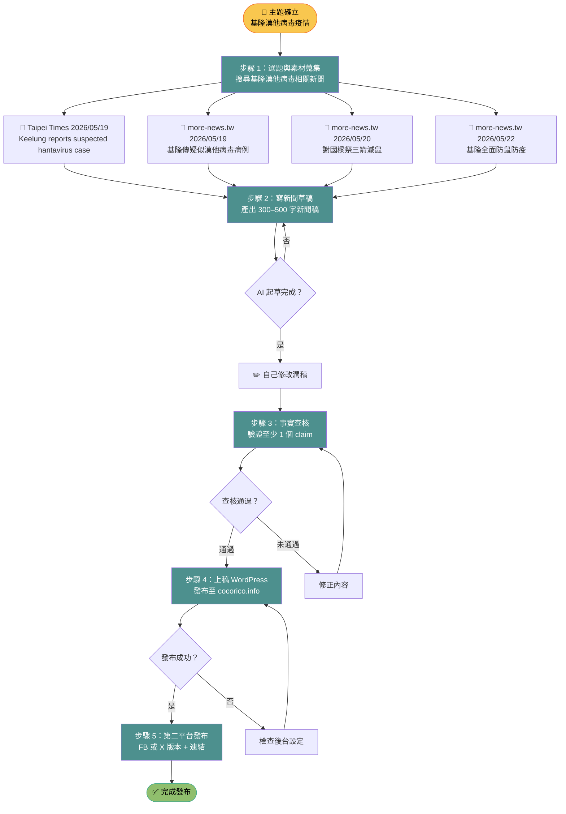

# 新聞專題 Pipeline 流程圖
## 主題：基隆漢他病毒疫情（2026年5月）

## 工具與負責人對照

| 步驟 | 工具 | 負責人 |
|------|------|--------|
| 1. 選題與素材蒐集 | Kiro | AI + 自己確認 |
| 2. 寫新聞草稿 | Kiro | AI 起草，自己修改 |
| 3. 事實查核 | Google + Kiro | 自己做 |
| 4. 上稿 WordPress | WordPress 後台 | 自己操作 |
| 5. 第二平台發布 | Facebook / X | 自己操作 |
